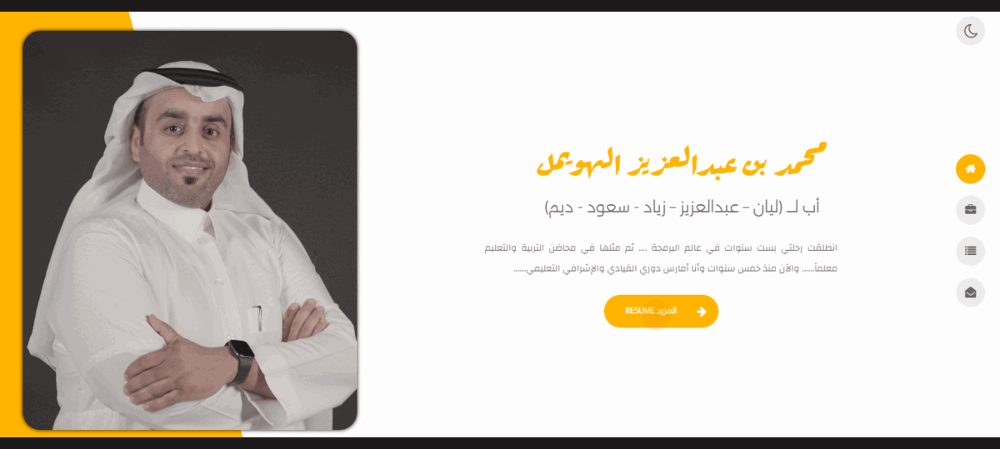

# Portfolio Website with Django, Django REST Framework, Next.js, Framer Motion, and PostgreSQL


---

## Used

- __Django__ Python web framework
- __Django REST Framework__ APIs
- __PostgreSQL__
- __Next.js 14__ Frontend
- __Framer Motion__


## Installation

- __Create a Virtual Environment:__

```bash
cd backend

python -m venv venv

venv\Scripts\activate
```
- __Install Required Backend Dependencie:__
```bash
pip install -r requirements.txt

```
- __Set Up Backend Environment Variables:__

    Declare environment variables in the .env file (without quotation marks):

```bash
DEBUG=on
SECRET_KEY=
DATABASE_HOST=
DATABASE_PASS=
DATABASE_USER=
DATABASE_NAME=
DATABASE_PORT=
FRONTEND_URL=http://localhost:3000
SENDGRID_API_KEY=

```
- __Frontend Setup (Next.js)__

```
cd frontend
npm install
```
- __Declare environment variables in the .env file__

```
DATABASE_HOST='localhost'
BACKEND_URL='http://localhost:8000/api/'
BACK_BACKEND_URL_STATIC='http://localhost:8000/'
RESEND_API_KEY=
```

##  Demo
[__Frontend demo__ ](https://mhuwaimel.netlify.app/ "Mhuwaimel")


## Conclusion

By the end of this project, you’ll have a professional portfolio website that reflects your skills and creativity. Feel free to customize it further, experiment with animations, and make it uniquely yours! 🚀


